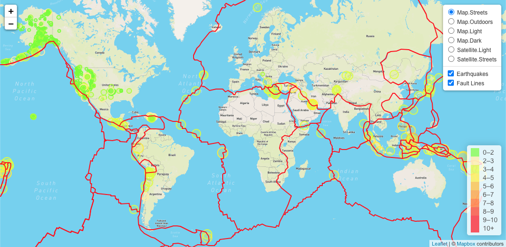

## Leaflet Challenge 
 
 
### Used the following Mapbox styles

- mapbox://styles/mapbox/streets-v11
- mapbox://styles/mapbox/outdoors-v11
- mapbox://styles/mapbox/light-v10
- mapbox://styles/mapbox/dark-v10
- mapbox://styles/mapbox/satellite-v9
- mapbox://styles/mapbox/satellite-streets-v11 

https://docs.mapbox.com/api/maps/

### To use this repo
```sh
yarn install  --> install npm packages
yarn start    --> run development server
yarn build    --> build produnction image
```

